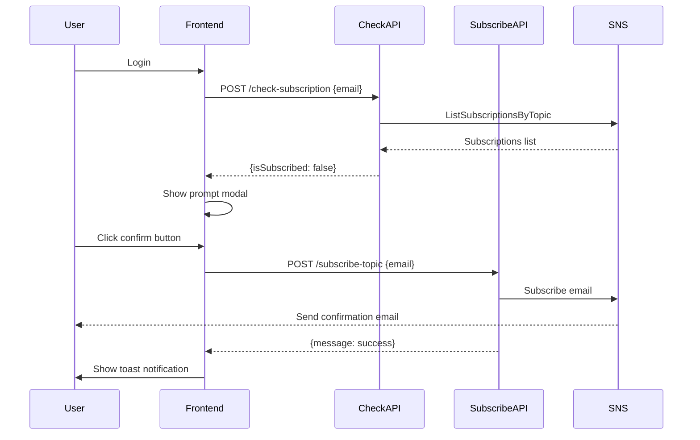
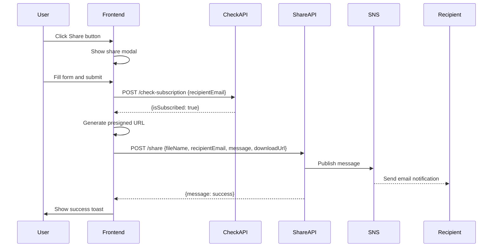

# 📧 通知系統使用指南

## 📋 目錄

1. [功能概述](#功能概述)
2. [Subscribe 功能](#subscribe-功能)
3. [Share 功能](#share-功能)
4. [SNS Topic 訂閱流程](#sns-topic-訂閱流程)
5. [前端和後端交互流程](#前端和後端交互流程)
6. [常見問題](#常見問題)

---

## 功能概述

Dropbex 的通知系統基於 AWS SNS (Simple Notification Service)，提供兩個核心功能：

1. **Subscribe 功能**：使用者可以訂閱 SNS Topic，接收來自其他使用者的通知
2. **Share 功能**：使用者可以分享檔案給其他已訂閱的使用者

---

## Subscribe 功能

### 功能說明

當使用者登入系統時（包含帳號密碼登入和 Session 恢復），系統會自動檢查該使用者的 email 是否已訂閱 SNS Topic。

### 運作流程

1. **登入觸發檢查**
   - 使用者輸入帳號密碼登入
   - 或使用者重新整理頁面（Session 恢復）
   - 系統自動呼叫 `/check-subscription` API

2. **訂閱狀態檢查**
   - 後端查詢 SNS Topic 的所有訂閱者
   - 檢查使用者的 email 是否存在於已確認的訂閱列表中

3. **顯示提示（若未訂閱）**
   - 若使用者未訂閱，前端會彈出提示視窗
   - 提示內容：「若您想接收其他人的通知，請到信箱中點選確認信」
   - 提供「確認」按鈕

4. **訂閱請求**
   - 使用者點擊「確認」按鈕
   - 前端呼叫 `/subscribe-topic` API
   - 後端向 SNS Topic 發送訂閱請求
   - AWS SNS 會自動發送確認信到使用者的 email

5. **確認訂閱**
   - 使用者收到確認信後，點擊確認連結
   - 完成訂閱後，該 email 即可接收通知

### 前端實作

**檔案位置**：`frontend/js/subscription.js`

**主要函數**：
- `checkUserSubscription(email)`: 檢查訂閱狀態
- `subscribeUserEmail(email)`: 發送訂閱請求
- `showSubscriptionPrompt(email)`: 顯示訂閱提示模態框
- `checkAndPromptSubscription(email)`: 統一檢查與提示函數

**整合位置**：
- `frontend/js/auth.js` 的 `switchToLoggedInLayout()` 函數
- `frontend/js/auth.js` 的 `checkCurrentSession()` 函數

### 後端實作

**API 端點**：
- `POST /check-subscription`: 檢查 email 是否已訂閱
- `POST /subscribe-topic`: 訂閱 email 到 SNS Topic

**Lambda 函數**：
- `CheckSubscriptionHandler`: 檢查訂閱狀態
- `SubscribeEmailHandler`: 處理訂閱請求

---

## Share 功能

### 功能說明

使用者可以透過「Share」按鈕分享檔案給其他使用者。系統會先驗證收件人是否已訂閱，只有已訂閱的收件人才能收到分享通知。

### 運作流程

1. **開啟分享模態框**
   - 使用者在檔案列表中點擊「Share」按鈕（➦）
   - 前端顯示分享模態框

2. **填寫分享資訊**
   - 「傳送到電子郵件」：輸入收件人的 email
   - 「想對他說的話」：輸入自訂訊息（支援換行）

3. **驗證收件人訂閱狀態**
   - 前端呼叫 `/check-subscription` API
   - 檢查收件人是否已訂閱 SNS Topic

4. **處理結果**

   **情況 A：收件人未訂閱**
   - 顯示錯誤提示：「對方尚未到信箱點選確認接收，因此無法接收訊息」
   - 不發送通知

   **情況 B：收件人已訂閱**
   - 生成檔案下載連結（S3 預簽名 URL，有效期 7 天）
   - 呼叫 `/share` API
   - 後端發送 SNS 通知到收件人
   - 顯示成功提示：「分享通知已發送」

5. **收件人接收通知**
   - 收件人收到 email 通知
   - 郵件內容包含：
     - 檔案名稱
     - 分享者的話
     - 下載連結

### 前端實作

**檔案位置**：`frontend/js/dashboard.js`

**主要函數**：
- `showShareModal(s3Key)`: 顯示分享模態框
- `handleShareSubmit(s3Key, recipientEmail, customMessage)`: 處理分享表單提交
- `closeShareModal()`: 關閉分享模態框

**觸發位置**：
- `handleTeamShare(s3Key)`: 在檔案列表的 Share 按鈕中呼叫

### 後端實作

**API 端點**：
- `POST /share`: 發送檔案分享通知

**Lambda 函數**：
- `ShareFileHandler`: 處理分享通知，發送到 SNS Topic

**請求參數**：
```json
{
  "fileName": "example.pdf",
  "recipientEmail": "recipient@example.com",
  "customMessage": "請查看這個檔案",
  "downloadUrl": "https://s3.amazonaws.com/..."
}
```

**郵件格式**：
```
Subject: [Dropbex] 有人分享了檔案給您

檔案名稱: example.pdf

分享者的話:
請查看這個檔案

下載連結:
https://s3.amazonaws.com/...

---
此訊息由 Dropbex 系統自動發送
```

---

## SNS Topic 訂閱流程

### 訂閱狀態

SNS Topic 的訂閱者有三種狀態：

1. **PendingConfirmation**：已發送訂閱請求，等待使用者確認
2. **Confirmed**：使用者已點擊確認連結，訂閱完成（SubscriptionArn 為真正的 ARN，格式：`arn:aws:sns:...`）
3. **Deleted**：訂閱已取消（使用者點擊退訂連結後，AWS SNS 會保留此記錄）

### 訂閱狀態檢查邏輯

`CheckSubscriptionHandler` 判定使用者「已訂閱」的條件：
- Protocol 必須是 `email`
- Endpoint 必須匹配查詢的 email
- **SubscriptionArn 必須是真正的 ARN**（以 `arn:aws:sns:` 開頭）

這個邏輯會自動排除：
- `PendingConfirmation`：等待確認中，尚未完成訂閱
- `Deleted`：已退訂，應視為未訂閱

### 訂閱流程圖

```
使用者登入
    ↓
檢查訂閱狀態
    ↓
是否已訂閱？
    ├─ 是 → 不顯示任何提示
    └─ 否 → 顯示訂閱提示
            ↓
        使用者點擊確認
            ↓
        發送訂閱請求
            ↓
        AWS SNS 發送確認信
            ↓
        使用者收到確認信
            ↓
        使用者點擊確認連結
            ↓
        訂閱完成（狀態：Confirmed）
```

### 確認訂閱

1. 使用者收到來自 AWS SNS 的確認信
2. 郵件標題通常為：「AWS Notification - Subscription Confirmation」
3. 點擊郵件中的確認連結
4. 瀏覽器會開啟確認頁面，顯示「Subscription confirmed!」
5. 訂閱狀態變更為「Confirmed」

---

## 前端和後端交互流程

### Subscribe 流程



### Share 流程



---

## 常見問題

### Q1: 為什麼我沒有收到訂閱確認信？

**可能原因**：
1. 郵件被歸類為垃圾郵件
2. Email 地址輸入錯誤
3. AWS SNS 發送延遲（通常幾秒到幾分鐘）

**解決方案**：
1. 檢查垃圾郵件資料夾
2. 確認 email 地址正確
3. 等待幾分鐘後再檢查
4. 可以重新發送訂閱請求

### Q2: 為什麼分享時顯示「對方尚未到信箱點選確認接收」？

**原因**：
收件人尚未完成 SNS Topic 的訂閱確認。

**解決方案**：
1. 請收件人先登入系統並完成訂閱確認
2. 或請收件人檢查 email 中的確認信並點擊確認連結

### Q3: 訂閱確認信的有效期是多久？

**答案**：
AWS SNS 的訂閱確認連結通常沒有明確的有效期，但建議盡快確認。如果連結失效，可以重新發送訂閱請求。

### Q4: 如何取消訂閱？

**方法**：
1. 在 AWS SNS Console 中取消訂閱
2. 或回覆確認信中的取消連結（如果有的話）

### Q5: 可以分享給多個收件人嗎？

**目前限制**：
目前一次只能分享給一個收件人。如需分享給多人，請分別發送多次。

### Q6: 下載連結的有效期是多久？

**答案**：
目前設定為 7 天（604800 秒）。超過有效期後，連結將無法使用。

---

## 技術細節

### API 端點

| 端點 | 方法 | 功能 | 請求參數 |
|------|------|------|---------|
| `/check-subscription` | POST | 檢查訂閱狀態 | `{email: string}` |
| `/subscribe-topic` | POST | 訂閱 SNS Topic | `{email: string}` |
| `/share` | POST | 分享檔案 | `{fileName: string, recipientEmail: string, customMessage: string, downloadUrl?: string}` |

### 環境變數

後端 Lambda 函數需要以下環境變數：

- `SNS_TOPIC_ARN`: SNS Topic 的 ARN
- `AWS_REGION`: AWS 區域（預設：us-east-1）

### 前端配置

在 `frontend/js/config.js` 中需要設定：

```javascript
const AWS_CONFIG = {
    checkSubscriptionApiUrl: 'https://.../check-subscription',
    subscribeApiUrl: 'https://.../subscribe-topic',
    shareApiUrl: 'https://.../share',
    // ... 其他配置
};
```

---

## 更新記錄

- **2025-01-XX**: 初始版本，實作 Subscribe 和 Share 功能

